<h1 align="center">Spaceshi</h1>

<p align="center">
  <b>A realistic 3D universe sandbox that runs entirely in your browser.</b><br>
  Fly from low Earth orbit to the Milky Way's core and out to thousands of galaxies.<br>
  Then reach into the Solar System and bend orbits under live gravity.
</p>

<p align="center">
  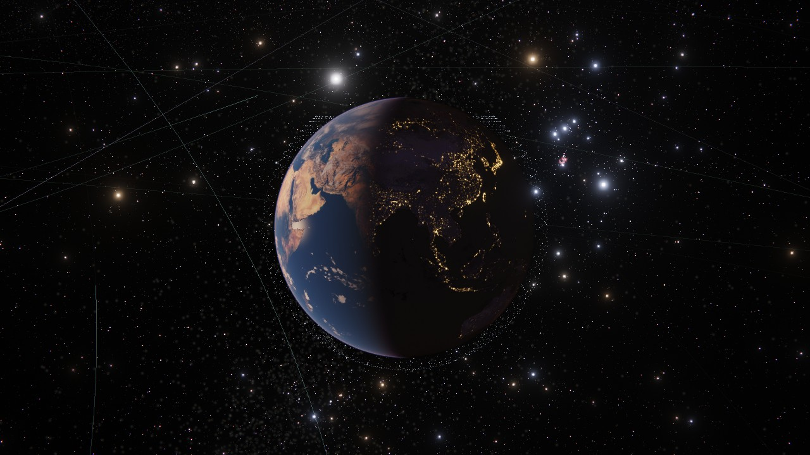
</p>

You are a free-floating observer, not a ship. There is no backend, no account and no telemetry: `npm start` serves a static site you can host on your own PC or server.

<table>
  <tr>
    <td width="50%">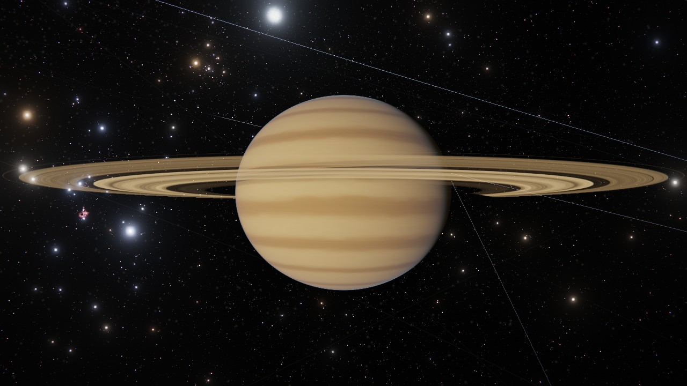<br><sub><b>Saturn</b>: banded atmosphere, ringlets and gaps, ring shadows.</sub></td>
    <td width="50%">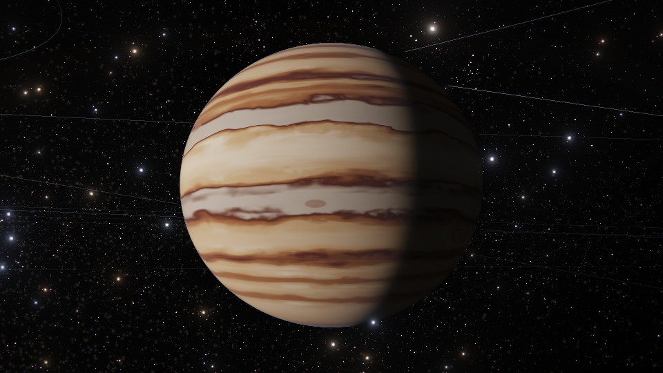<br><sub><b>Jupiter</b>: belts, zones, festoons and the Great Red Spot.</sub></td>
  </tr>
  <tr>
    <td>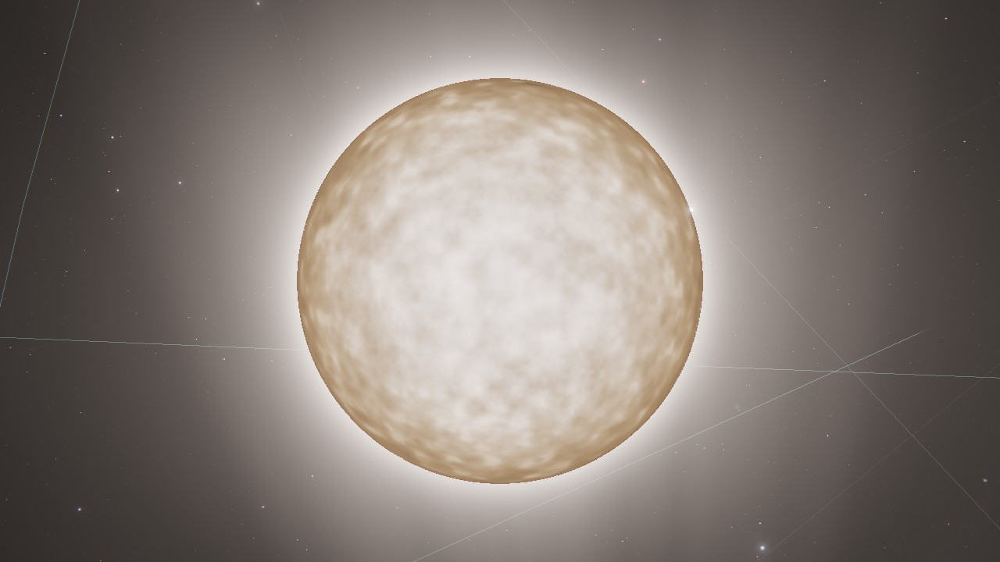<br><sub><b>The Sun</b>: limb darkening and granulation that sharpens as you approach.</sub></td>
    <td>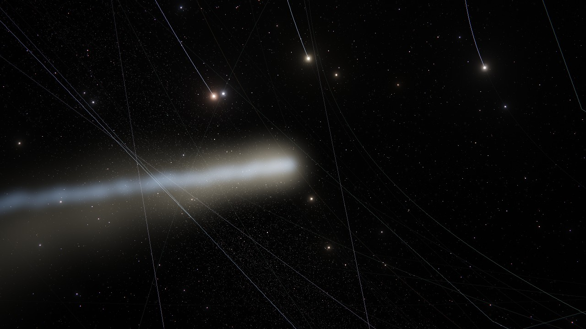<br><sub><b>Comet NEOWISE</b>: coma, curved dust tail and straight ion tail.</sub></td>
  </tr>
  <tr>
    <td>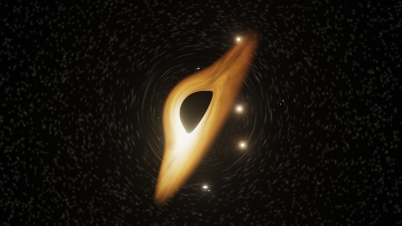<br><sub><b>Sagittarius A*</b>: ray-traced lensing and a Doppler-beamed accretion disc.</sub></td>
    <td>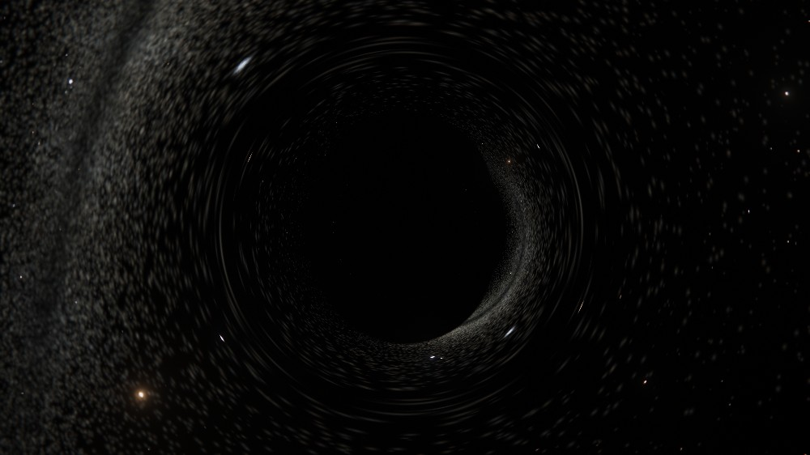<br><sub><b>Gaia BH1</b>, the nearest known black hole: no disc, just a shadow and a bent sky.</sub></td>
  </tr>
  <tr>
    <td>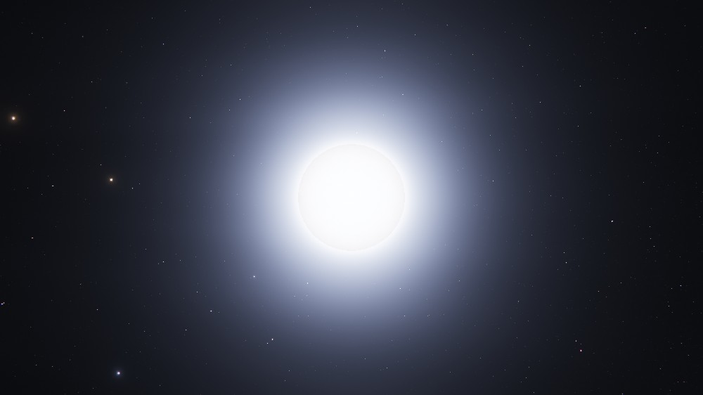<br><sub><b>Sirius B</b>, the nearest white dwarf (8.6 ly).</sub></td>
    <td>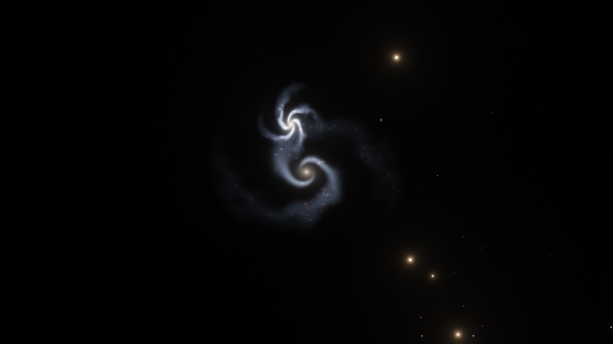<br><sub><b>Whirlpool Galaxy</b>: a physically sized deep-sky sprite (procedural spiral).</sub></td>
  </tr>
  <tr>
    <td>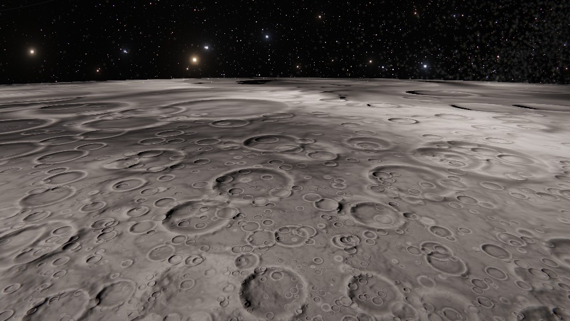<br><sub><b>The Moon</b> from 3 km up: layered craters with central peaks.</sub></td>
    <td>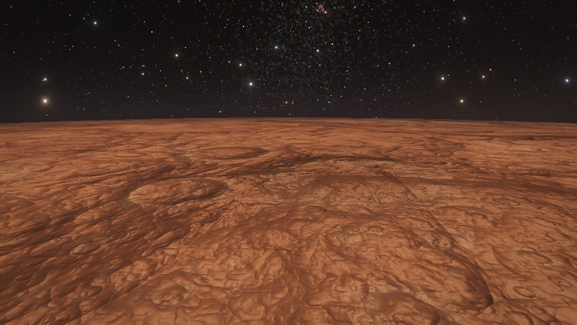<br><sub><b>Mars</b> from 10 km up: scale-free terrain relief and dusty lowlands.</sub></td>
  </tr>
</table>

<sub>All images are real captures from the game, taken with software rendering in headless Chromium at reduced resolution. On a GPU with adaptive resolution enabled it looks sharper. Galaxies and nebulae are procedural sprites placed at catalogue positions, not photographs.</sub>

## Highlights

- **The real sky.** 109,400 catalogue stars (with proper motion inside ~106 ly), 3,800 exoplanet systems, 12,000+ deep-sky objects (galaxies, nebulae, clusters), all 88 constellations, the Milky Way seen from inside and outside, and a cosmic-web backdrop.
- **The real Solar System.** The eight planets with JPL orbital elements and IAU poles and rotation, Pluto and the dwarf planets, ~110 moons, notable asteroids, comets (with tails), interstellar visitors, belts (main, Hildas, Trojans, Kuiper, Oort), Starlink/GPS/GEO shells and famous spacecraft.
- **Star systems on demand.** Fly to a star and it grows a planetary system: real planets from the Open Exoplanet Catalogue where known, physically plausible procedural ones elsewhere.
- **Compact objects.** Black holes are ray-traced through Schwarzschild geodesics: gravitational lensing of the sky and a Doppler-beamed accretion disc. Sgr A\*, M87\*, Cygnus X-1, TON 618, Gaia BH1/BH3, pulsars and white dwarfs, and more.
- **Live N-body sandbox.** Select anything and grab it, throw it, change its mass or velocity, circularise its orbit, delete it, or add planets, moons, stars and black holes. A symplectic Yoshida-4 integrator keeps orbits honest; collisions merge bodies and conserve momentum.
- **Every object has stats.** Type, mass, radius, gravity, temperature, rotation, orbit (osculating for edited bodies), distance from you, and a short description.
- **Czech and English, metric and imperial.** Switch the language (top bar or *Settings*) and the unit system (*Settings*) at any time: the whole HUD, every object's name, type, description and facts, search (which ignores diacritics: `zeme` finds *Země*), dates and numbers follow. The choice is remembered, and the first visit picks a default from your browser.
- **Movement that feels good.** Distance-scaled free flight, orbit mode, cinematic "go to" travel across 20 orders of magnitude, sphere-of-influence frames that co-move with what you're near, and a telescope zoom.

<p align="center">
  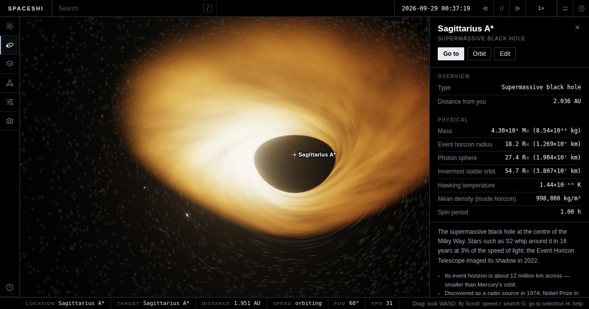<br>
  <sub>The interface: search, time controls, layers and tools on the left, and an info panel for whatever you select.</sub>
</p>

## Quick start

Node 20 or newer.

```bash
npm install
npm start          # builds on first run, then serves http://localhost:8080
```

Other ways to run it:

| Command | What it does |
|---|---|
| `npm run dev` | Vite dev server with hot reload on :5173 |
| `npm run build` | Typecheck and produce `dist/` |
| `npm start` | Zero-dependency static server for `dist/` (brotli/gzip, immutable caching). `PORT=3000 HOST=127.0.0.1 npm start` to change binding |
| `docker build -t spaceshi . && docker run -p 8080:8080 spaceshi` | Same server in a container |
| `npm test` | Ephemeris, Kepler and physics tests |
| `npm run data` | Re-download source catalogues and regenerate `public/data/` |

`npm start` prints your LAN addresses, so you can open the game from another machine on your network. To host it publicly, put `dist/` behind any static host or reverse proxy; there is nothing server-side to secure.

### Requirements

A desktop browser with **WebGL 2** and hardware acceleration (current Chrome, Edge or Firefox). A discrete or recent integrated GPU is recommended. Under *Settings*:

- **Adaptive resolution** (on by default) supersamples up to 1.5x on standard-DPI screens for cleaner edges, and steps the internal resolution down automatically if the frame rate drops.
- **Surface detail** (Minimal to Ultra) sets how many noise octaves and crater generations each body gets. Lower it on slower GPUs.
- **Render scale** is a manual resolution multiplier on top.

## Controls

| | |
|---|---|
| **Look** | Drag with the mouse |
| **Fly** | `W` `A` `S` `D`, `R`/`F` up/down, `Q`/`E` roll, `Shift` boost, `Ctrl` fine control |
| **Speed** | Mouse wheel (or zoom when orbiting). Speed scales automatically with distance to the nearest object |
| **Telescope** | Hold `Z`, scroll to zoom |
| **Search** | `/` (stars, planets, moons, galaxies, spacecraft…) |
| **Select / go to** | Click selects; double-click or `G` flies to the selection; `C` orbits it; `Backspace` returns to the previous target; `Home` shows the whole Solar System; `Esc` deselects |
| **Time** | `Space` pause, `,` / `.` slower / faster (up to one million years per second), `B` reverse, `T` jump to now |
| **Interface** | `L` labels, `O` orbit paths, `U` hide interface, `P` photo mode, `H` help |

Orbit paths of moons and satellites are hidden by default so planets stay clean; enable them under *Layers → Orbits around planets and moons*. Select a body and use the **Sandbox** tools in the left toolbar to edit it.

Language and units live under *Settings*; the `EN`/`CS` button in the top bar switches language in one click.

Some places to start: search for `Sagittarius A*`, `Gaia BH1`, `Sirius`, `Whirlpool`, `Andromeda`, `Halley` or `Proxima`.

## How it works

- **Precision.** Positions live on the CPU in double precision (SI units, ICRS axes, Sun at the origin) and everything is rendered camera-relative, so a metre-sized error never appears at any of the ~30 orders of magnitude the scene spans.
- **Painter's algorithm, no depth buffer.** Each resolved body is a single screen-aligned quad whose fragment shader ray-casts an analytic (oblate or triaxial) ellipsoid: procedural terrain, gas-giant bands and storms, Earth textures with clouds and city lights, single-scattering atmospheres, rings with mutual shadows, eclipses, and analytic limb anti-aliasing. Bodies are drawn far to near, which sidesteps the depth-precision problems of huge scenes.
- **Detail without polygons.** Because bodies are analytic surfaces rather than meshes, there is no polygon count to raise: the shader adds noise octaves, crater generations, ringlets and granules until a feature would be smaller than about a pixel, then hands over to metre-scale ground detail. Zooming in keeps revealing structure instead of running out of texture.
- **Photometric sky.** Stars and unresolved planets are drawn from absolute magnitude and distance, exposure adapts to local light like an eye, and an HDR pipeline (dual-filter bloom, ACES tone mapping, dither) finishes the frame.
- **Physics.** Planets and moons follow analytic Keplerian rails until you touch anything; then the Yoshida-4 symplectic integrator takes over for massive bodies, with sub-stepped test particles for small ones, adaptive to time warp.
- **Black holes.** Each pixel integrates a null geodesic in `u = 1/r` (`u'' = −u + 1.5u²`) and resamples a snapshot of the already-rendered sky, so lensing works for the entire scene.

Source layout: `src/sim` (bodies, ephemerides, physics), `src/data` (catalogues and the Solar System), `src/render` (shaders and layers), `src/nav` (camera rig), `src/app` (sandbox, selection, audio), `src/ui` (HUD).

## Data and credits

Generated catalogue files in `public/data/` are built by `scripts/build-data.mjs` from:

| Source | Used for | Licence (per upstream) |
|---|---|---|
| [HYG Database v4.1](https://github.com/astronexus/HYG-Database) | 109,400 stars | CC BY-SA 4.0 |
| [OpenNGC](https://github.com/mattiaverga/OpenNGC) | NGC/IC/Messier objects | CC BY-SA 4.0 |
| [Open Exoplanet Catalogue](https://github.com/OpenExoplanetCatalogue/oec_tables) | Exoplanet systems | MIT |
| [Stellarium](https://github.com/Stellarium/stellarium) modern sky culture | Constellation lines | see upstream |
| JPL "Approximate Positions of the Planets" and IAU WGCCRE reports | Planet orbits, poles, rotation | public domain / published constants |

The Earth and Moon textures in `public/textures/` come from the [three.js examples](https://github.com/mrdoob/three.js/tree/dev/examples/textures/planets). Check their upstream terms before redistributing the project commercially. Every other surface (Mars, Jupiter, Saturn, asteroids, exoplanets…) is procedural.

Licences above are as stated by the upstream projects; verify them if you redistribute the data.

## Accuracy and limitations

Spaceshi aims for believable physics and correct scales, not survey-grade astrometry.

- Planet positions use JPL's approximate polynomials (arcminute-level for 1800–2050, degrading outside); moons use mean elements. Tests check Earth at J2000, Mars in 2003 and the new Moon.
- Star systems beyond the ~5,000 with measured planets are procedural. Exoplanet appearance is inferred from mass, radius and equilibrium temperature.
- The sky beyond ~100 ly uses catalogue positions with a procedural Milky Way and cosmic web; galaxies and nebulae are illustrative sprites, not photographs. The sky around a distant object is our own sky, not the sky as it would look from there.
- Earth and Moon use 2k/1k colour maps; finer detail is procedural noise layered on top, not real terrain.
- A black hole's companion star is not modelled (Gaia BH1 shows the hole alone).
- The Czech translation covers all hand-written content (about 180 objects) and everything generated by the game. Object names from large catalogues (e.g. HD/HIP designations) are international and stay as they are; a few deep-sky nicknames are descriptive translations rather than established Czech names.
- Fullscreen black-hole shading is GPU-heavy; with software rendering it will crawl.
- No relativistic time dilation is modelled outside the black-hole optics.

## Development

```bash
npm run dev         # hot-reload dev server
npm run typecheck
npm test
```

Developer helpers in `scripts/`: `screenshot.mjs` and `tour.mjs` capture headless views through Playwright with software GL (append `?quality=fixed` to the URL to disable adaptive resolution), and `window.__app.view('jupiter', 3, 60, 10)` jumps the camera in the browser console. The images in `docs/images/` were captured this way.

## Licence

MIT for the source code (see `LICENSE`). Data and textures keep their upstream licences as listed above.
